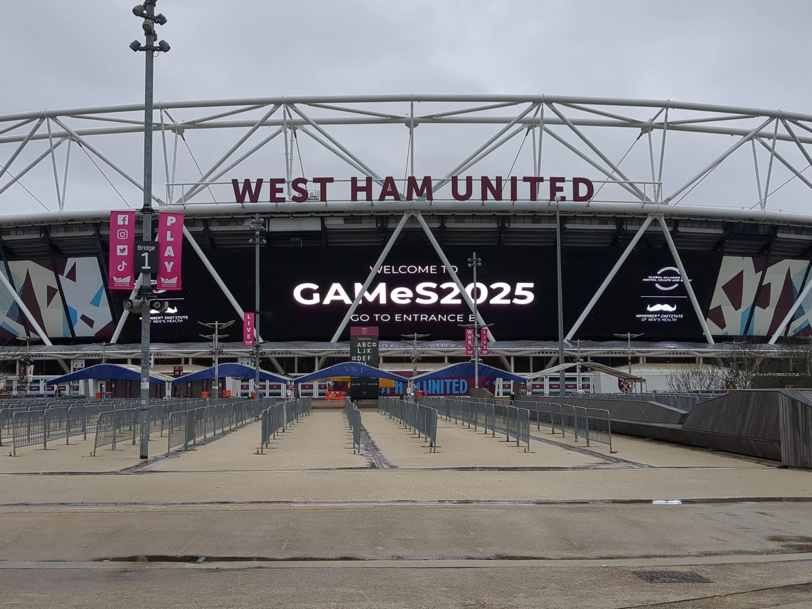

---
authors:
- admin
#- author2

categories:
- Research
- Talks

#- Category 1
date: "2025-11-22T00:00:00Z"
draft: false
featured: false
image:
  #caption: 'Image credit: [**Unsplash**](https://unsplash.com/photos/a-remote-control-sitting-on-top-of-a-wooden-table-lnNlBVMt9vc)'
  focal_point: ""
  placement: 2
  preview_only: true
lastmod: "2025-11-22T00:00:00Z"
projects: []
#subtitle: ""
summary: "Find out more about esports, mental health, and well-being"
tags:
- Research
- Conference
- Gaming
- Esports

title: Shaping the future of mental health in esports gaming
---

Over the course of two days last week, I had the honour of being part of an exciting and extremely important initiative led by world-leading researchers from multiple fields, together
with esports industry leaders, in partnership with the [**Movember Institute of Men's Health**](https://movember.com/) and the Global Alliance for Mental Health and Sport (GAMeS) at the
[**GAMeS Conference 2025**](https://thegamesconference.com/) in London, United Kingdom.

The Guideline Development Committee (GDC) scientific group which I am part of aims to develop a much-needed evidence-based international framework that will directly influence the 
course of the mental health and well-being landscape of esports worldwide.

During these two productive days, we discussed extensively the main priorities and domains that should fall within the scope of the forthcoming international guideline.
The discussions we had aimed at expanding the inspiring and incredibly impactful research conducted by leading experts in the field who are working closely with individuals engaged in esports. 
Some of these experts include [Dr. Dylan Poulus](https://www.scu.edu.au/about/contacts/directory/121221), [Dr. Mitchell Nicholson](https://research.qut.edu.au/epowr/people/mitchell-nicholson/),
among many others (apologies for not mentioning everyone else as the list was quite long).

I have learned a lot from my colleagues during these two days and on reflection, I realise that the broader esports community needs to continue working on championing player mental health and
well-being more systematically.

I look forward to the next stages of this important initiative. I will keep you posted on the next chapters!

# {style="text-align: justify;"}

Stay tuned and follow me on **[Mastodon](https://metalhead.club/@DrHalleyPontes)** and **[X](https://x.com/DrHalleyPontes)** for real-time updates on what's happening next!